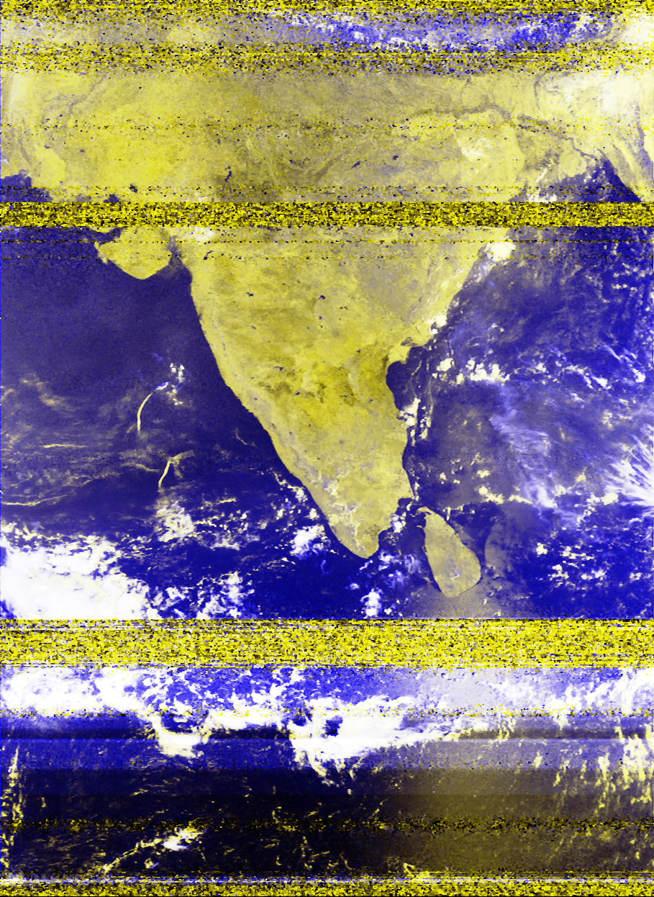

## NOAA/Meteor APT/LRPT Images from Bengaluru, India

This repository contains APT/LRPT images from NOAA 15, 18, 19, and Meteor MN2-3 satellites acquired in Bengaluru, India. The images are updated once in a while.


### Images

Here are some images from the repository:





### Animations

To create animations from the images, you can use a variety of software packages, such as ImageJ or FFmpeg.

Here is an example of how to create an animation using FFmpeg:


``` ffmpeg -framerate 1 -i images/*.jpg -c:v libx264 -pix_fmt yuv420p animation.mp4 ```


This will create an MP4 video file called `animation.mp4` with a frame rate of 1 frame per second.

### Contributing

Contributions to this repository are welcome. If you have any APT/LRPT images from NOAA 15, 18, 19, or Meteor MN2-3 satellites acquired from a satellite pass over India, please feel free to submit a pull request.

### License

This repository is licensed under the MIT License.
