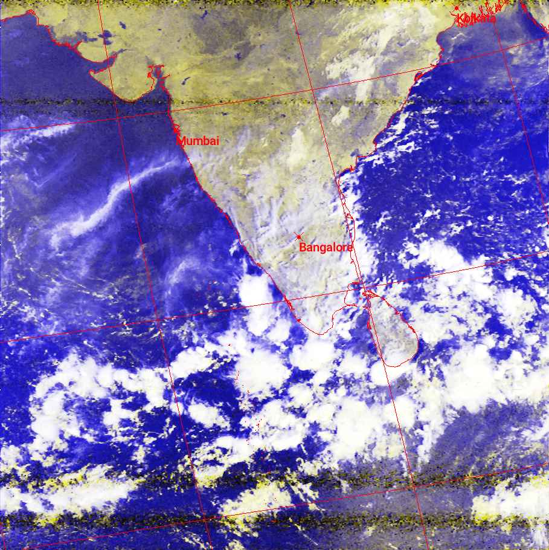

# Satellite Images from Bengaluru, India

This is where I store satellite images snapped by NOAA 15, 18, 19, and Meteor M2-3 satellites passing over Bengaluru, India. I update these images whenever something interesting flies by.

## Preview

Have a peek at some of the images in this repo:

## How To Do It

 Some handy tools to capture and decode these satellite signals:

- [Satdump](https://www.satdump.org/)
- [SDR++](https://www.sdrpp.org/)
- [noaa-apt](https://noaa-apt.mbernardi.com.ar/)
- [WXtoImg](https://wxtoimgrestored.xyz/downloads/)

## Give It a Try

If you're curious about using Satdump to grab satellite signals yourself, here's what you can do:

1. [Get the Satdump repository](https://github.com/SatDump/SatDump) on GitHub.
2. The repository has all the instructions you need to install and use the tool.
## Contributing
If you've got APT/LRPT images from NOAA 15, 18, 19, or Meteor M2-3 satellites passing over India, feel free to send me a pull request. 

